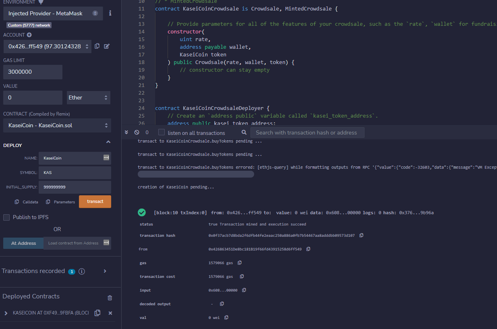
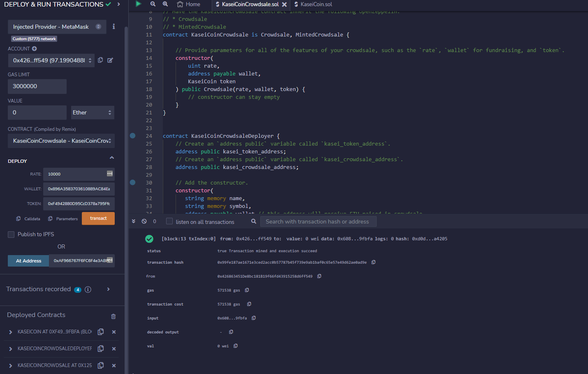
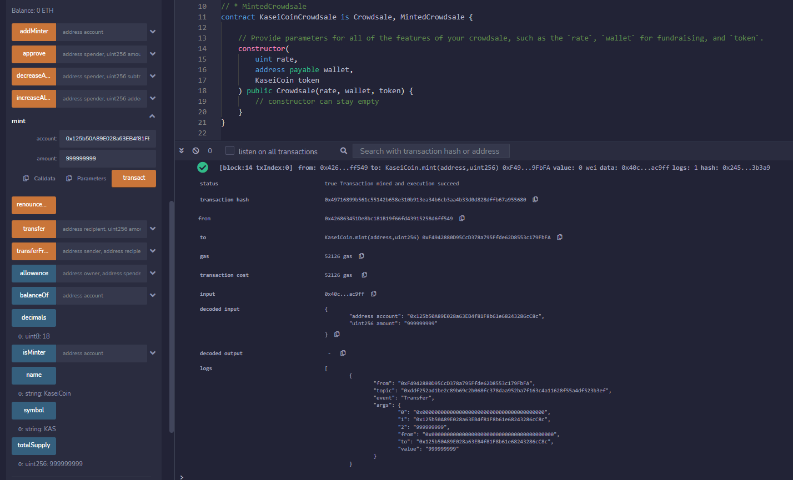
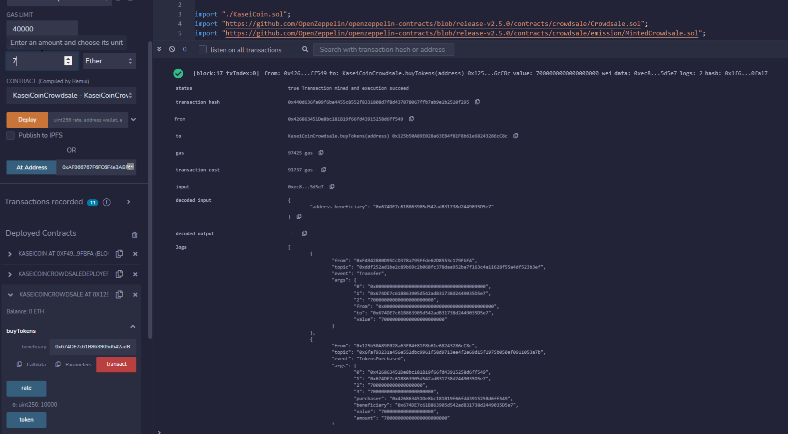
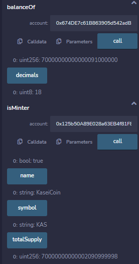
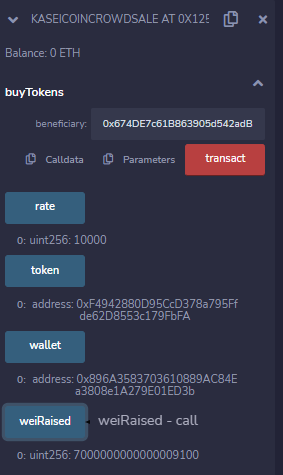

# Module 21 - Advanced Solidity
## KaseiCoin Summary
This project involves creating a smart contract that defines an ERC-20 token, a crowdsale contract, and a deployer contract for the token and crowdsale. The token and crowdsale contract use OpenZeppelin's ERC20, ERC20Detailed, Crowdsale, and MintedCrowdsale contracts. The deployer contract is used to deploy both the token and the crowdsale contracts.

To create the ERC-20 token contract, a new contract called KaseiCoin is defined, which inherits the ERC20, ERC20Detailed, and ERC20Mintable contracts. The KaseiCoin contract includes a constructor with parameters for name, symbol, and initial supply. This constructor calls the constructor of ERC20Detailed to pass the name, symbol, and decimal value of 18.

To create the crowdsale contract, a new contract called KaseiCoinCrowdsale is defined, which inherits the Crowdsale and MintedCrowdsale contracts. In the KaseiCoinCrowdsale constructor, parameters such as rate, wallet, and token are specified.

To create the deployer contract, the KaseiCoinCrowdsaleDeployer contract is uncommented. This contract includes variables to store the addresses of the KaseiCoin and KaseiCoinCrowdsale contracts. The deployer contract is initialized with name, symbol, and wallet parameters. In the constructor, a new instance of the KaseiCoinToken contract is created and the KaseiCoinCrowdsale contract is created using specified parameters. The KaseiCoinCrowdsale contract is set as a minter and the deployer contract renounces its minter role.

Finally, the crowdsale is deployed to a local blockchain using Remix, MetaMask, and Ganache. The crowdsale functionality is tested using test accounts to buy new tokens, and the total supply of minted tokens and the amount of wei raised by the crowdsale contract are reviewed.

## Evaluation Results
I was able to successfully compile and deploy both contracts, in the below image it can be seen that I set the coin name to `KaseiCoin`, symbol to `KAS` and initial supply to `999999999`. 

Next, I used the `kaseicoincrowdsaledeployer` contract to fetch the wallet address for the crowdsale, and used this to import the crowdsale contract.

After deplpoying both contracts, I experimented with minting tokens to the crowdsale contract, buying tokens using various wallet addresses from Ganache, and checking data including the balance of KAS in various wallets, total coin supply and total WEI raised. See images below.

